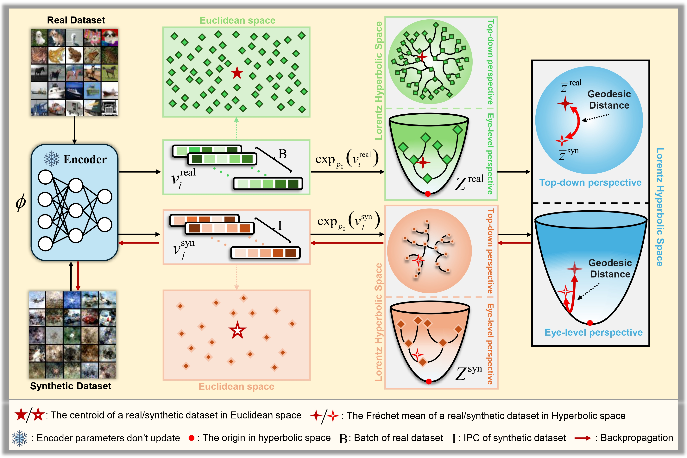

# Hyperbolic Dataset Distillation (NeurIPS 2025)
[](https://arxiv.org/abs/2505.24623)
[](https://guang000.github.io/HDD-Webpage/)

The first dataset distillation framework that leverages hyperbolic geometry to preserve hierarchical data structures.
The repository is based on [geoopt](https://github.com/geoopt) , [DM](https://github.com/VICO-UoE/DatasetCondensation) and [IDM](https://github.com/uitrbn/IDM/tree/main). 

<p align="center">
  
</p>

- Code will be released soon (About Dec 2025).
- Oct 2025: Project page was released.
- Sept 2025: Our paper has been accepted to NeurIPS 2025!
- May 2025: Preprint was released.

## 🎯 Key Contributions

- Hyperbolic Geometry for Dataset Distillation
Introduces the first dataset distillation framework in hyperbolic space, enabling natural modeling of hierarchical data structures.

- Centroid Alignment via Geodesic Distance
Minimizes the Lorentzian hyperbolic distance between Fréchet means of real and synthetic datasets, ensuring semantic and geometric consistency.

- Hierarchical Sample Weighting
Derives analytic weighting that prioritizes prototype-like (root-level) samples while attenuating noisy, peripheral ones.

- Efficient Hierarchical Pruning
Demonstrates that only 20% of the original data is sufficient to maintain comparable accuracy, highlighting hyperbolic redundancy reduction.

- Broad Compatibility & Superior Results
Integrates smoothly with DM and IDM, yielding consistent gains in classification accuracy and training stability across diverse datasets.

## Usage
```
cd IDM-HDD
python3 -u IDM_cifar10.py --dataset CIFAR10 --model ConvNet --ipc 10 --dsa_strategy color_crop_cutout_flip_scale_rotate --init real --lr_img 1 --num_exp 5 --num_eval 5 --net_train_real --eval_interval 100 --outer_loop 1 --mismatch_lambda 0 --net_decay --embed_last 1000 --syn_ce --ce_weight 0.5 --train_net_num 1 --aug

```

## Citing HDD
If you find this project useful for your research, please use the following BibTeX entry.
```
@inproceedings{li2025hdd,
  title={Hyperbolic Dataset Distillation},
  author={Li, Wenyuan and Li, Guang and Maeda, Keisuke and Ogawa, Takahiro and Haseyama, Miki},
  booktitle={Proceedings of the Advances in Neural Information Processing Systems (NeurIPS)},
  year={2025}
}
```
